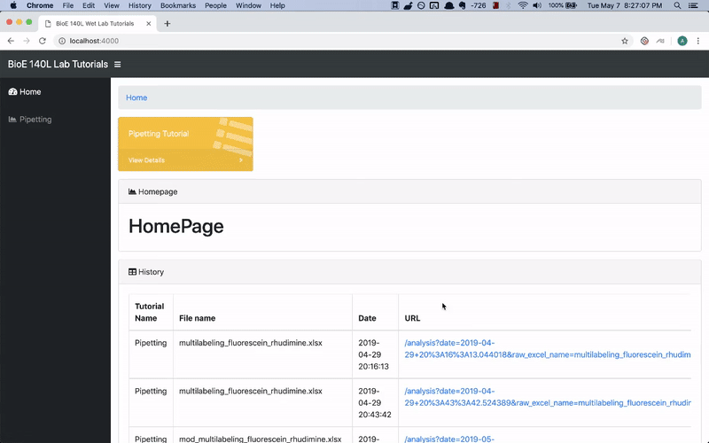
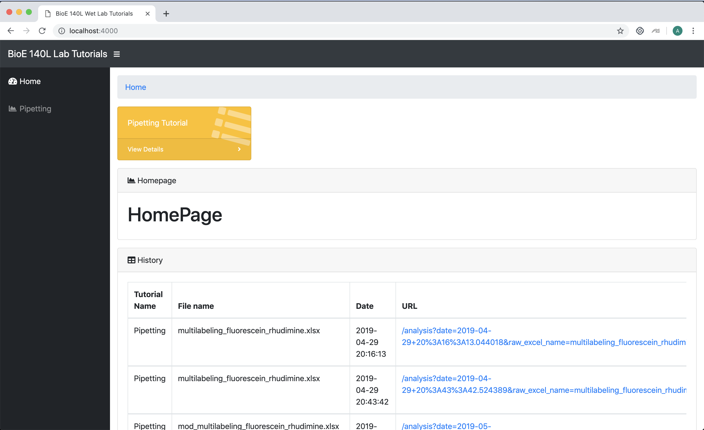
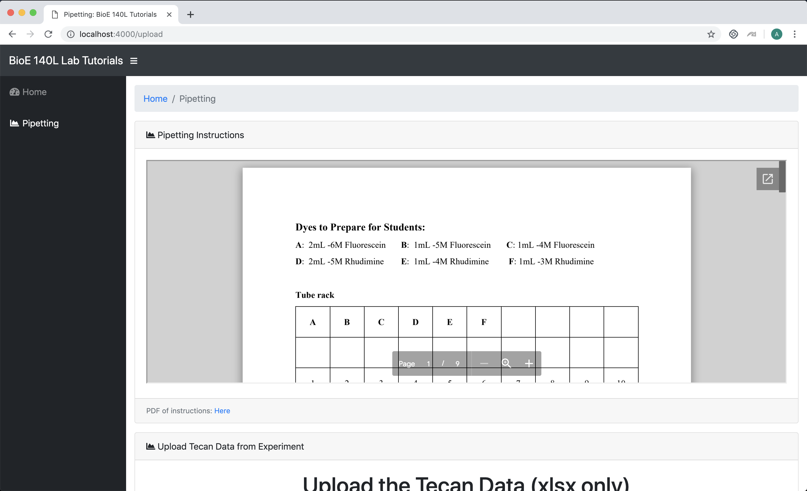
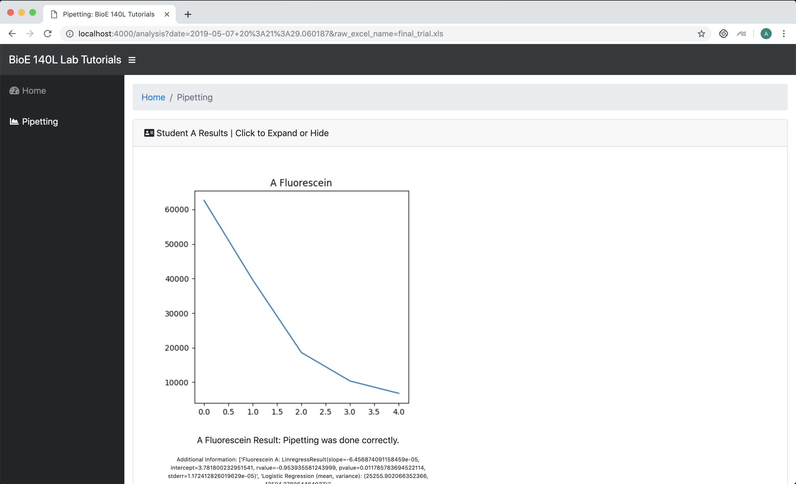

# Pipette Training Automation
## Training software accompanying BioE 140L (Spring '19)

# Description

Initial / Detailed Specifications: <a href = "https://github.com/nathan2wong/PipetteTraining/blob/master/Pipette%20Training%20Automation_%20Design%20Specifications.pdf">Pipette Training Automation_ Design Specifications.pdf</a>

The goal of this project is to use create accompanying software to the Tecan fluorescence plate reader instrument in order to more efficiently determine the accuracy of a student's pipetting skills. The general idea is to have the students follow a simple liquid-transfer protocol (included in the Protocols directory). The liquid the students transfer has already been dyed using Fluorescein (and/or Rhodamine). After using the Tecan to read the fluorescence within various dilutions the students have made in a 96-well plate, this software, using mostly regression analysis and some experimental machine-learning approaches, will be able to determine whether the student has administered correct amounts of liquid, and thus whether the student has demonstrated competency in basic pipetting techniques.



# What's included

Data – contains all the information procured from our experimentation, as well student data from the wet-lab teams, in the form of excel (.xls, .xlsx) sheets.
Protocols – contains all the written protocols (and their past versions) for the students to follow.
Src – contains scripts, models, and visualizations (not all are finished / some were dropped) for ways to parse, analyze, and visualize the experimental data.
Webapp – contains the Python-Flask web application that is to be launched by the student when submitting their wet-lab pipetting data to be analyzed.

# Getting Started
1. Clone the repository from Github (https://github.com/nathan2wong/PipetteTraining)
2. Change directory into "webapp"
```
git clone https://github.com/nathan2wong/PipetteTraining
cd ~/PipetteTraining/webapp
```
3. Recommended: Use a Python virtual environment (Guide here: https://docs.python-guide.org/dev/virtualenvs/) at this step. Enter the virtualenv, or ensure that your system has Python3 (3.5 or later) installed.
4. View the requirements in requirements.txt. Download all python packages to make sure those requirements are met. How to download: Using pip, install the requirements using the command pip install -r requirements.txt. (Note: This step may require some light dependency sorting / debugging depending on your system setup).
```
cat requirements.txt
pip install -r requirements.txt
```
5. Launch the web application by running manage.py. You can now visit the application at http://localhost:4000
```
python3 manage.py
```

6. Upload the excel data in the Pipette Training page. Make sure the correct format is followed (final_trial.xls is a good example).

7. View the results once you press upload file. The results are structured such that each row ('A' to 'H') represent individual students.


# Full Tutorial

# PipetteTrainingTool-
